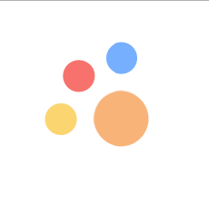

# Agilie/Action-button

[](https://packagephobia.now.sh/result?p=@agilie/action-button)
[](https://github.com/agilie/action-button/tree/master)


This is fixed floating action button.

## Install

```
$ npm install @agilie/action-button
```

```html
<link rel="stylesheet" href="main.css" />

<script src="common.js"></script>
```

## Usage

```html
<head>
  <link rel="stylesheet" href="main.css">
</head>
<body>
  <div class="wrap" id="js-btn-wrap">
    <div class="item"></div>
    <div class="item"></div>
    <div class="item"></div>
  </div>
  <script src="common.js"></script>
</body>
```

```js
var elemsContainer = document.getElementById('js-btn-wrap');
var instances = new AgilieBtn(elemsContainer);

instances.init();
```

##### As a result:

```html
  <div class="wrap addBtn__wrap top-left" id="js-btn-wrap">
    <button class="addBtn" id="js-addBtn" type="button" style="width: 80px; height: 80px; background-image: url('icons/plus_2.svg'); background-size: 30px; background-color: rgb(249, 180, 120);"></button>
    <div class="item addBtn__item" style="background-color: rgb(117, 174, 253);"></div>
    <div class="item addBtn__item" style="background-color: rgb(247, 113, 109);"></div>
    <div class="item addBtn__item" style="background-color: rgb(251, 213, 112);"></div>
  </div>
```

## Examples

##### Base usage

```html
  <div class="wrap" id="js-btn-wrap">
    <div class="item"></div>
    <div class="item"></div>
    <div class="item"></div>
  </div>
  <script type="text/javascript">
    var elemsContainer = document.getElementById('js-btn-wrap');
    var instances = new AgilieBtn(elemsContainer);

    instances.init();
  </script>
```



## Contact us
If you have any questions, suggestions or just need a help with web or mobile development, please email us at <web@agilie.com>. You can ask us anything from basic to complex questions.

We will continue publishing new open-source projects. Stay with us, more updates will follow!
