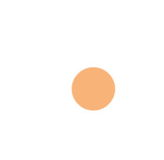

# Agilie/Action-button

[](https://packagephobia.now.sh/result?p=@agilie/action-button)
[](https://github.com/agilie/action-button/tree/master)


This is fixed floating action button.

## Install

1. From CDN:
```html
  <script src="https://unpkg.com/@agilie/action-button@0.1.1/dist/css/main.css"></script>
  <script src="https://unpkg.com/@agilie/action-button@0.1.1/dist/js/common.js"></script>
```
2. From Git Repository:
```
$ git clone https://github.com/agilie/action-button.git
```
3. From NPM:
```
$ npm install @agilie/action-button
```


## Usage

1. From CDN:
```html
<head>
  <script src="https://unpkg.com/@agilie/action-button@0.1.1/dist/css/main.css"></script>
  <script src="https://unpkg.com/@agilie/action-button@0.1.1/dist/js/common.js"></script>
</head>
<body>
  <div class="wrap" id="js-btn-wrap">
    <div class="item"></div>
    <div class="item"></div>
    <div class="item"></div>
  </div>
</body>
```

```js
var elemsWrap = document.getElementById('js-btn-wrap');
var actionBtn = new ActionBtn(elemsWrap);
```
2. From Git Repository:
<head>
  <script src="AddButton/dist/css/main.css"></script>
  <script src="AddButton/dist/js/common.js"></script>
</head>
<body>
  <div class="wrap" id="js-btn-wrap">
    <div class="item"></div>
    <div class="item"></div>
    <div class="item"></div>
  </div>
</body>
```

```js
var elemsWrap = document.getElementById('js-btn-wrap');
var actionBtn = new ActionBtn(elemsWrap);
```
3. From NPM:
import our package from your module bundler (webpack)
```js
var actionBtn = require('@agilie/action-button');
```

##### As a result:

```html
  <div class="addBtn__wrapper" style="width: 80px; height: 80px;">
    <div class="wrap addBtn__wrap" id="js-btn-wrap" style="width: auto; height: auto;">
      <button class="addBtn addBtn--close" type="button" style="width: 80px; height: 80px; background-color: rgb(249, 180, 120); animation-iteration-count: 3;"></button>
      <div class="item addBtn__item" style="height: 45px; width: 45px; background-color: rgb(117, 174, 253); transition-delay: 0s; transition-duration: 0.8s; transform: translate(0px);"></div>
      <div class="item addBtn__item" style="height: 45px; width: 45px; background-color: rgb(247, 113, 109); transition-delay: 0.5s; transition-duration: 0.8s; transform: translate(0px);"></div>
      <div class="item addBtn__item" style="height: 45px; width: 45px; background-color: rgb(251, 213, 112); transition-delay: 1s; transition-duration: 0.8s; transform: translate(0px);"></div>
    </div>
  </div>
```

## Examples

##### Base usage

```html
  <div class="wrap" id="js-btn-wrap">
    <div class="item"></div>
    <div class="item"></div>
    <div class="item"></div>
  </div>
  <script type="text/javascript">
    var elemsContainer = document.getElementById('js-btn-wrap');
    var instances = new ActionBtn(elemsContainer);
  </script>
```



## Contact us
If you have any questions, suggestions or just need a help with web or mobile development, please email us at <web@agilie.com>. You can ask us anything from basic to complex questions.

We will continue publishing new open-source projects. Stay with us, more updates will follow!
